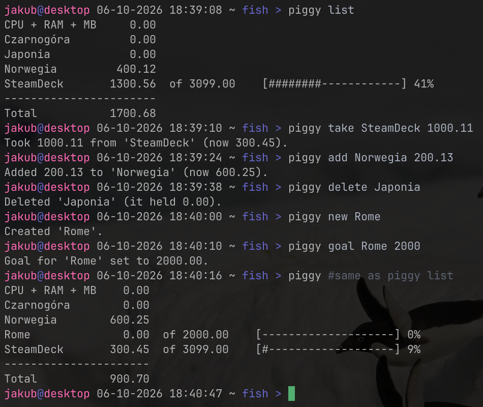

# 🐷 Piggy (v0.2.0)

A simple, built with rust CLI savings tracker. Set goals, track saved money, and check your progress, whilst still in the terminal.



## Functionality

| Command  | Description                    | Example                         |
|----------|--------------------------------|---------------------------------|
| `list`   | Lists all your goals           | `piggy list`                    |
| `new`    | Creates a new goal             | `piggy new "Trip to Norway"`    |
| `delete` | Deletes a goal                 | `piggy delete Laptop`           |
| `add`    | Adds money to a goal           | `piggy add SteamDeck 200`       |
| `take`   | Takes money from a goal        | `piggy take "Trip to Japan" 50` |
| `goal`   | Changes a goal's target amount | `piggy goal Course 100`         |

## Installation

### Nix (flakes)

Run without installing:

```bash
nix run github:TestkaJakub/piggy -- list
```

Install to your profile:

```bash
nix profile install github:TestkaJakub/piggy
```

On NixOS, add Piggy as a flake input and include it in your packages:

```nix
# flake.nix
inputs.piggy.url = "github:TestkaJakub/piggy";

# configuration.nix
environment.systemPackages = [
  inputs.piggy.packages.${pkgs.system}.default
];
```

### Nix (without flakes)

```bash
git clone https://github.com/TestkaJakub/piggy.git
cd piggy
nix-build -E 'with import <nixpkgs> {}; callPackage ./package.nix {}'
```

### Cargo

```bash
git clone https://github.com/TestkaJakub/piggy.git
cd piggy
cargo install --path .
```

## Contributing

Issues and pull requests are welcome. For bigger changes, please open an issue first to discuss what you'd like to change.

## Forks and modified versions

You're free to fork Piggy and keep its name, logo, and other branding, even in modified versions. Just make sure to:

- clearly describe your changes (e.g. in your README),
- not present your version as the original project,
- keep the `LICENSE` and `NOTICE` files.

See [NOTICE](NOTICE) for details.

## License

Licensed under the [Apache License 2.0](LICENSE).